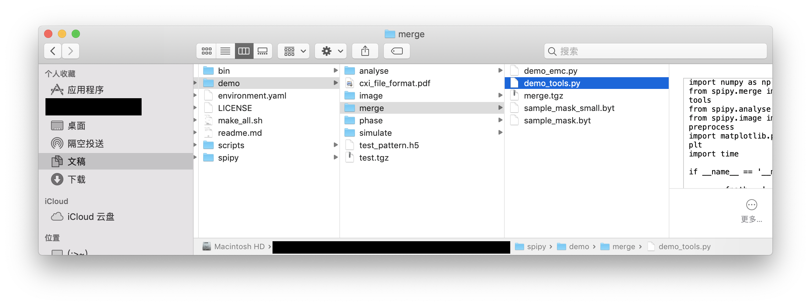
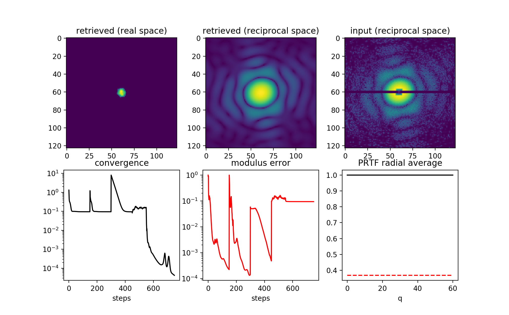
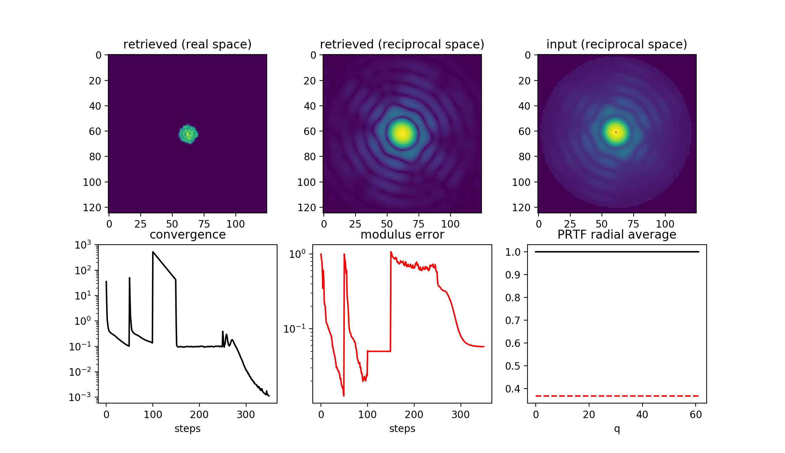
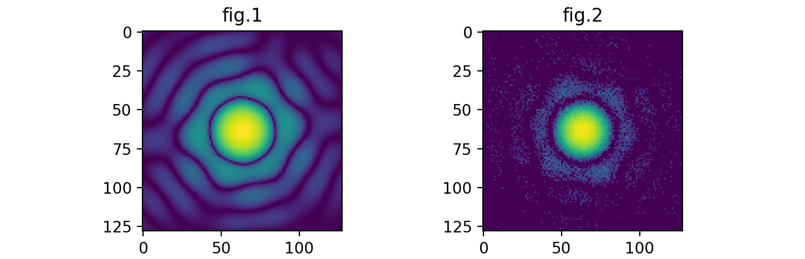
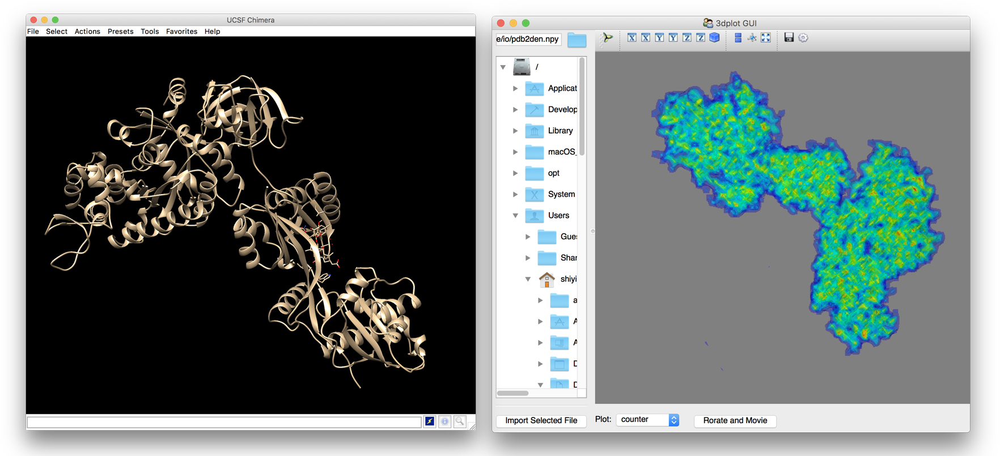
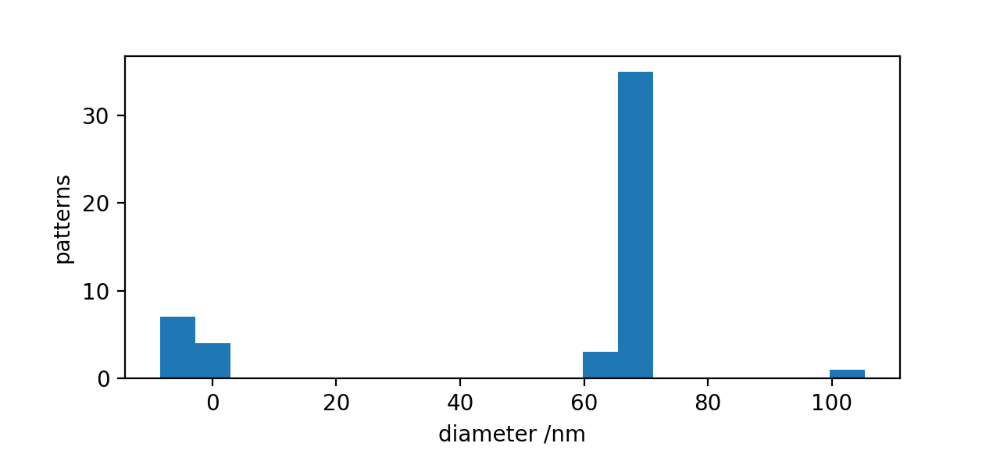
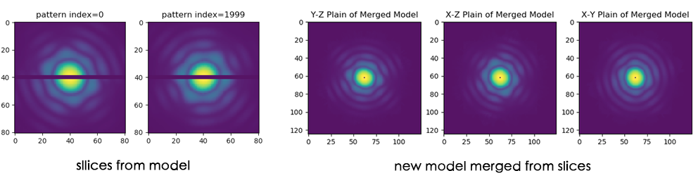

* Show help information
```python
Ipython 7.8.0
In [1]: import spipy
In [2]: spipy.info.VERSION
In [3]: spipy.help()
In [4]: from spipy import analyse
In [5]: analyse.help()
In [6]: analyse.rotate.help("align")
```

* Import modules
```python
Ipython 7.8.0
In [1]: from spipy import *
```

* Try functions
    * Go into *demo* folder, for each module there are some example python scripts. Play with them !



* Try scripts
	* After running "make_all.sh" there will be a "bin" folder, try those executable files inside !

* Some results
	* **spipy.phase.phModel** : Phase retrieval results (2D and 3D)


	* **spipy.simulate.sim_adu** : simulation results (intensity pattern and photon pattern)

	* **spipy.image.io** : read pdb, transfer to density map and view ([DataViewer-download](https://github.com/estonshi/DataViewer))

	* **spipy.image.preprocess** : hit-finding, transfer intensity to photon, fix artifact, ...

	* **spipy.analyse.saxs** : find diffraction center, estimate particle size, ...

	* **spipy.merge.tools** : slicing and merging, likelihood calculation, ...

	* more functions please refer to [framework](framework.md)