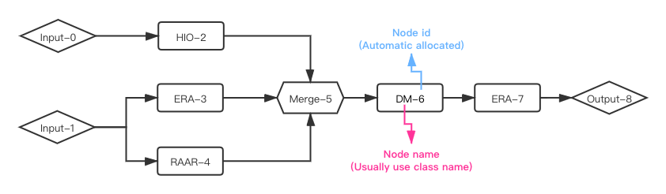

**Phase Retrieval Network Framework (Suggested)**

In this framework, you can use different algorithms to build a phasing network, just like building a neural network using pytorch. Here every **node** contains an algorithm and the **data stream** goes through all of the nodes in your specified order. The framework supports multiple input nodes and single output node. It could do phasing of both **2D pattern** and **3D volume** inputs.

Now the framework contains **ERA** / **HIO** / **DM** / **RAAR** / **HPR** algorithms. More methods are under design and will be released later. See an example network below for a straight forward look.



> phase.phmodel

**NOTE-1** : All of the classes in 'phmodel' module has a 'run' function, which will be called by **phexec.Runner** to run a node, please do not change it.

**NOTE-2** : Every instance of classes in 'phmodel' has an 'id' attribute, which is the identical number of a node in the network.

- class **pInput** : input node of a phasing network
    - \_\_init\_\_ (self, config\_dict, name=None)
        - `config_dict` : parameter dict

        ```
        {
            # input diffraction intensity (both 2D and 3D data are fine)
            "pattern_path" : xxx.npy,

            # input mask (masked pixel is 1, unmasked pixel is 0)
            "mask_path" : xxx.npy,

            # the center location of input pattern
            "center" : [62,62] (or [62,62,62]),
            
            # radius of central mask, set None to ignore
            "center_mask" : 5,
            
            # inside and outside radius of a ring area to be masked, set None to ignore
            "edge_mask" : [60,64],
            
            # inside and outside radius of a ring area where pattern pixels will be set to 0
            "edge_remove" : None,
            
            # subtract input pattern by a percentile of itself, usually set to False
            "subtract_percentile" : False,
            
            # radius a fixed circle support, set None to ignore
            "fixed_support_r" : 10,
            
            # whether to fit backgound in phasing
            "background" : True,
            
            # the initial model, set None to use random initiaion
            "initial_model" : xxx.npy
        }
        ```
        
        - `name` : name of this node, default is class name

        [__return__] self. The 'pInput' nodes should be the first layer of network and thus they don't have 'after' function.

- class **pOutput** : output node of a phasing network
    - \_\_init\_\_ (self, name=None)
        - `name` : name of this node, default is class name
    - after (self, father_node)
        - `father_node` : add father of this node
        
        [__return__] self. You can use this function for serval times to add multiple fathers to this node. Importantly, 'pOutput' node could not be father of any nodes.

- class **pMerge** : doing average to data streams from father nodes
    - \_\_init\_\_ (self, name=None)
        - `name` : name of this node, default is class name
    - after (self, father_node)
        - `father_node` : add father to this node
        
        [__return__] self. You can use this function for serval times to add multiple fathers to this node.

- class **ERA** : "Error Reduction" algorithm node
    - \_\_init\_\_ (self, iteration, support_size, name=None)
        - `iteration` : how many iterations for ERA to run, int
        - `support_size` : (estimated) number of pixels within final retrieved support, int
        - `name` : name of this node, default is class name
    - after (self, father_node)
        - `father_node` : add a father to this node
        
        [__return__] self. You can use this function for serval times to add multiple fathers to this node.

- class **DM** : "Difference Map" algorithm node
    - \_\_init\_\_ (self, iteration, support_size, name=None)
        - the same with ERA
    - after (self, father_node)
        - `father_node` : add a father to this node
        
        [__return__] self. You can use this function for serval times to add multiple fathers to this node.

- class **RAAR** : RAAR algorithm node
    - \_\_init\_\_ (self, iteration, support_size, beta, name=None)
        - `beta` : a float from \[0,1\]. If beta==0, then RAAR degenerate to ERA
        - others are same with ERA
    - after (self, father_node)
        - `father_node` : add a father to this node
        
        [__return__] self. You can use this function for serval times to add multiple father to this node.

- class **HIO** : "Hybrid Input Output" algorithm node
    - \_\_init\_\_ (self, iteration, support_size,  gamma, name=None)
        - `gamma` : greedy rate, a float from (0,1]. If gamma==1, then HIO degenerate to ERA
        - others are same with ERA
    - after (self, father_node)
        - `father_node` : add a father to this node
        
        [__return__] self. You can use this function for serval times to add multiple father to this node.
        
- class **HPR** : "Hybrid projectopn restriction" algorithm node
    - \_\_init\_\_ (self, iteration, support_size, gamma, hprcoff=0.5, name=None)
        - `gamma` : greedy rate, a float from (0,1]. If gamma==1, then HIO degenerate to ERA
        - `hprcoff` : the threshold of overlapping rate (R\_v) between supports from two iterations, a float from (0,1). If R\_v>hprcoff then apply HPR iteration, otherwise apply HIO iteration.
        - others are same with ERA
    - after (self, father_node)
        - `father_node` : add a father to this node
        
        [__return__] self. You can use this function for serval times to add multiple fathers to this node.

> phase.phexec

- class **Runner** : running phasing network, support mpi4py parallel
    - \_\_init\_\_ (self, inputnodes = None, outputnode = None, loadfile = None, reload_dataset = None, comm = None)
        - `inputnodes` : a list of "pInput" instances, the input nodes of the whole network
        - `outputnode` : one "pOutput" instance, the output node of the network
        - `loadfile` : str, file path, load network from this json file
        - `reload_dataset` : a dict, {input_node_id : {"pattern\_path" : "xxx.npy", "mask\_path" : "xxx.npy" or None, "initial\_model" : "xxx.npy" or None}, ...}. The input data stream will be reloaded. Only valid when 'loadfile' is given. Necessary when 'loadfile' is a skeleton network file.
        - `comm` : communicator of MPI ranks. If you use mpi4py, please provide this variable. Default is None.

        [__NOTE__] You can specify either `inputnode` + `outputnode` or `loadfile` + `reload_dataset` to initiate a Runner.
        
    - run (self, repeat=1)
        - `repeat` : times of independent phasing **of single mpi rank**, int
    - dump\_model (self, model\_file, skeleton = False)
        - `model_file` : str, file path to save this phasing network
        - `skeleton` : bool, whether to save input data stream of this network, save (False) or not save (True)

        [__return__] A file will be generated to describe the network you created. You can share this file to others to build a same network.

    - save\_h5 (self, out, save_file)
        - `out` : the output data stream from pOutput node
        - `save_file` : save output data stream to a HDF5 file

**--- Programming example to build a network model like the figure above ---**

```python
# Examles of using PRNF programming,
# you can find more at "spipy/test_spipy/phase/test_phmodel.py"

import numpy as np
from spipy.phase import phexec, phmodel

from mpi4py import MPI
comm = MPI.COMM_WORLD
mrank = comm.Get_rank()
msize = comm.Get_size()

if __name__ == "__main__":

    config_input = {
        "pattern_path" : "pattern.npy",
        "mask_path" : "pat_mask.npy",
        "center" : [61,61],
        "center_mask" : 5,
        "edge_mask" : None,
        "subtract_percentile" : False,
        "fixed_support_r" : None,
        "background" : True,
        "initial_model" : None
    }
    iters = [150,100,200]
    support_size = 85
    beta = 0.8
    gamma = 0.05
    newdataset = {"pattern_path" : "pattern.npy", "mask_path" : "pat_mask.npy", "initial_model" : None}

    # set up network
    l1_0 = phmodel.pInput(config_input)
    l1_1 = phmodel.pInput(config_input)
    l2_0 = phmodel.HIO(iters[0], support_size, gamma).after(l1_0)
    l2_1 = phmodel.ERA(iters[0], support_size).after(l1_1)
    l2_2 = phmodel.RAAR(iters[0], support_size, beta).after(l1_1)
    lm = phmodel.pMerge().after(l2_0).after(l2_1).after(l2_2)
    l4 = phmodel.DM(iters[1], support_size).after(lm)
    l5 = phmodel.HIO(iters[2], support_size, gamma).after(l4)
    l6 = phmodel.pOutput().after(l5)

    # run
    runner = phexec.Runner(inputnodes = [l1_0, l1_1], outputnode = l6)
    out = runner.run(repeat = 1)

    if mrank == 0:
        runner.plot_result(out)

    # Dump network
    runner.dump_model("temp_model.json", skeleton=False)

    # Reload network
    runner2 = phexec.Runner(inputnodes = None, outputnode = None, \
        loadfile = "temp_model.json", reload_dataset = {l1_0.id:newdataset})
    out = runner2.run(repeat = 1)
```

---
**Functional based phase retrieval program (deprecated)**

* _Phase retrieval algorithms_ :
    * _ER (error reduction)_
    * _DM (difference map)_
    * _RAAR (relaxed averaged alternating reflections)_

> phase.phase2d

-> _2d pattern phase retrieval_

```ini
# 2d phase retrieval basic parameters
- 'input|shape' : input pattern shape, default='123,123'

- 'input|padd_to_pow2' : zero padding to make the size of pattern to be a 2^n number, default=True

- 'input|inner_mask' : pixels whose radius<inner_mask are allowed to float while phasing, default=5

- 'input|outer_mask' : pixels whose radius>outer_mask are set to zero, default=64

- 'input|outer_outer_mask' : pixels whose radius are between outer_mask and outer_outer_mask are allowed to float, default=None

- 'input|mask_edges' : bool, whether allow pixels between outer_mask and outer_outer_mask to float, default=True

- 'phasing|repeats' : how many times of independent phasing for **every process**, default=40

- 'phasing|iters' : schedual iterations for 1 phasing loop, default is '100RAAR 200DM 200ERA' which means '100 times RAAR algorithm -> 200 times DM algorithm -> 200 times ER algorithm'

- 'phasing_parameters|support_size' : set restriction to the number of pixels inside final support of shrinkwrap process, default=200

- 'phasing_parameters|beta' : beta value for RAAR algorithm, float from 0 to 1, default=0.8

# 2d phase retrieval advanced parameters
- 'input|subtract_percentile' : subtract the X percentile value of data for all pixels, float value from 0 to 100, default=None

- 'input|spherical_support' : radius of spherical support that added at the initiation, default=None

- 'input|init_model' : filepath of initial REAL space model. Support .npy, .bin and .mat file formats. The size of init model should agree with 'input|shape' after 'input|padd_2_pow', default=None

- 'phasing_parameters|background' : evaluate background while phasing, default=True
```

> phase.phase3d

-> _3d volume phase retrieval_

```ini
# 3d phase retrieval basic parameters
- 'input|shape' : input pattern shape, default='120,120,120'

- 'input|padd_to_pow2' : zero padding to make the size of pattern to be a 2^n number, default=True

- 'input|inner_mask' : pixels whose radius<inner_mask are allowed to float while phasing, default=3

- 'input|outer_mask' : pixels whose radius>outer_mask are set to zero, default=64

- 'input|outer_outer_mask' : pixels whose radius are between outer_mask and outer_outer_mask are allowed to float, default=None

- 'input|mask_edges' : bool, whether allow pixels between outer_mask and outer_outer_mask to float, default=False

- 'phasing|repeats' : how many times of independent phasing for **every process**, default=40

- 'phasing|iters' : schedual iterations for 1 phasing loop, default is '100RAAR 200DM 200ERA' which means '100 times RAAR algorithm -> 200 times DM algorithm -> 200 times ER algorithm'

- 'phasing_parameters|voxel_number' : set restriction to the number of pixels inside final support of shrinkwrap process, default=2000

- 'phasing_parameters|beta' : beta value for RAAR algorithm, float from 0 to 1, default=0.8

# 3d phase retrieval advanced parameters
- 'input|subtract_percentile' : subtract the X percentile value of data for all pixels, float value from 0 to 100, default=None

- 'input|spherical_support' : radius of spherical support that added at the initiation, default=None

- 'input|init_model' : filepath of initial REAL space model. Support .npy, .bin and .mat file formats. The size of init model should agree with 'input|shape' after 'input|padd_2_pow', default=None

- 'phasing_parameters|background' : evaluate background while phasing, default=True
```

**phase.phase3d and phase.phase2d have same *APIs*** : 

- **new_project** (data_path, mask_path=None, path=None, name=None)
    - `data_path` : path of your original diffraction data, support '.npy' or '.mat', or '.bin' files. For '.bin' file, dtype should be *float*
    - `mask_path` : path of user-defined mask file, a 0/1 numpy array where 1 means masked point
    - `path` : create work directory under this path, set None to use current dir
    - `name` : give a name to your project, set None to let program choose one for you

    [__return__] create project, no return

- **config_project** (params)
    - `params` : dict, parameters (see above) to configure

    [__return__] configuration, no return

- **run_project** (num_proc=1, nohup=False, cluster=False)
    - `num_proc` : int, this function maps multi-processes automatically, so you need to figure out how many processes to run in parallel
    - `nohup` : bool, whether run in background
    - `cluster` : bool, whether you will submit jobs using job scheduling system, if True, the function will only generate a command file at your work path without submitting it; if False, the program will run directly

    [__return__] start phase retrieval, no return

- **use_project** (project_path)
    - `project_path` : string, the path of project directory that you want to switch to

    [__return__] switch to a existing project, no return
