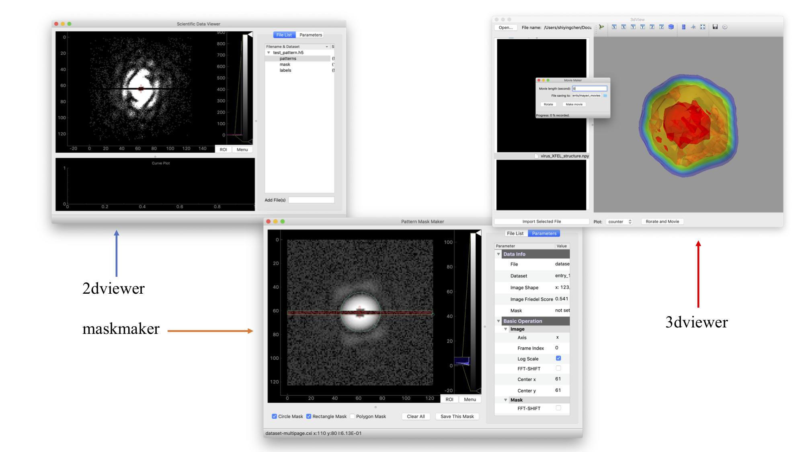

The *spi_viewer* script provided users with a integrated data visualization GUI, including 2dviewer, 3d viewer and maskmaker. This part is forked from [https://github.com/LiuLab-CSRC/DataViewer](https://github.com/LiuLab-CSRC/DataViewer) where detailed document is presented.

